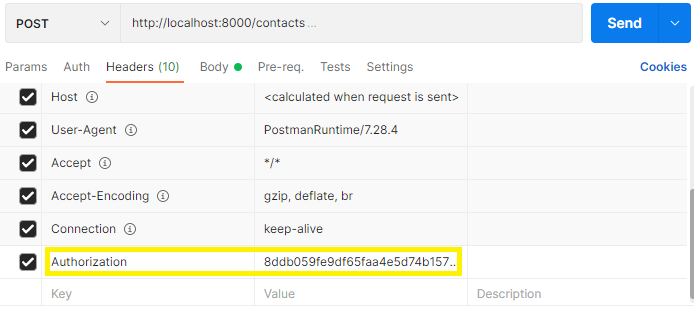
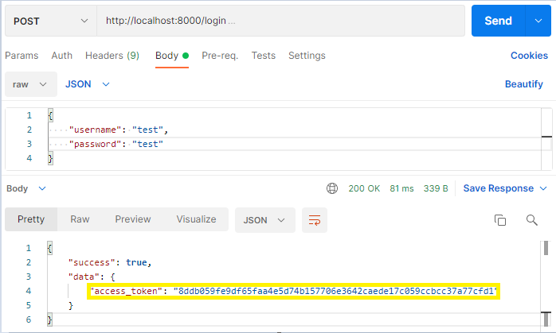
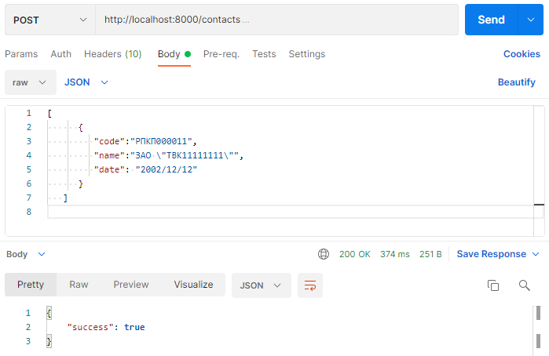

# API сервера
Для работы с сервером данных предусмотрена следующая схема:
1. Клиент проходит аутентификацию с использованием выданного логина и пароля.
2. В случае успешной аутентификации сервер отправляет клиенту токен доступа.
3. При дальнейшем обращении к серверу клиент использует токен доступа. Сервер проверяет токен на валидность и предоставляет клиенту доступ к ресурсам.
4. В случае, если токен становится невалидным, клиент проходит аутентификацию повторно.

Полученный токен необходимо передавать в заголовке запроса в поле “Authorization” в формате: Authorization: [access_token].

## Получение токена доступа

URI: /login.

Имя пользователя и пароль передаются в теле запроса.

Пример запроса для получения токена:

POST http://localhost:8000/login

~~~
Headers:
  "Content-Type": "application/json"

Body:
  {
    "Username": "username",
    "Password": "userpassword"
  }
~~~

В случае успешного выполнения запроса сервер вернет ответ с токеном в свойстве “access_token”, пример:

Если будут переданы неверные данные пользователя, сервер вернет ответ с ошибкой, пример:
~~~
{
    "success": false,
    "error": {
        "code": 401,
        "message": "Неверный пароль"
    }
}
~~~

## Загрузка данных в Гедымин
Для добавления данных на сервере в тело запроса необходимо передавать массив записей справочника или документа.

### Контакты
Пример запроса загрузки контактов:

POST http://localhost:8000/contacts

~~~
Headers:
"Authorization": "6f58226d0f9bf726a216498b52ac75b838d8066d08c47d3999ece00abd76";
"ContentType": "application/json".

Body:
[
  {
     "code":"РПКП000011",
     "name":"ЗАО \"ТВК11111111\"",
     "date": "2002/12/12"
   }
]
~~~
При успешной авторизации и загрузки данных сервер вернет ответ:

Сервер вернет ответ с ошибкой
* если токен не будет соответствовать:
~~~
{
    "success": false,
    "error": {
        "code": 401,
        "message": "Не пройдена авторизация"
    }
}
~~~

* если неверный формат данных:
~~~
{
    "success": false,
    "error": {
        "code": 500,
        "message": "Неверный формат данных"
    }
}
~~~

### Единицы измерения
POST http://localhost:8000/values

~~~
Headers:
"Authorization": "6f58226d0f9bf726a216498b52ac75b838d8066d08c47d3999ece00abd76";
"ContentType": "application/json".

Body:
[]
~~~

### Группы товаров
POST http://localhost:8000/goodgroups

~~~
Headers:
"Authorization": "6f58226d0f9bf726a216498b52ac75b838d8066d08c47d3999ece00abd76";
"ContentType": "application/json".

Body:
[]
~~~

### Товары
POST http://localhost:8000/goods

~~~
Headers:
"Authorization": "6f58226d0f9bf726a216498b52ac75b838d8066d08c47d3999ece00abd76";
"ContentType": "application/json".

Body:
[]
~~~

### Контракты
POST http://localhost:8000/contracts

~~~
Headers:
"Authorization": "6f58226d0f9bf726a216498b52ac75b838d8066d08c47d3999ece00abd76";
"ContentType": "application/json".

Body:
[]
~~~

### Протоколы
POST http://localhost:8000/protocols

~~~
Headers:
"Authorization": "6f58226d0f9bf726a216498b52ac75b838d8066d08c47d3999ece00abd76";
"ContentType": "application/json".

Body:
[]
~~~

### Заявки
POST http://localhost:8000/claims

~~~
Headers:
"Authorization": "6f58226d0f9bf726a216498b52ac75b838d8066d08c47d3999ece00abd76";
"ContentType": "application/json".

Body:
[]
~~~

### Остатки
POST http://localhost:8000/remains

~~~
Headers:
"Authorization": "6f58226d0f9bf726a216498b52ac75b838d8066d08c47d3999ece00abd76";
"ContentType": "application/json".

Body:
[]
~~~
